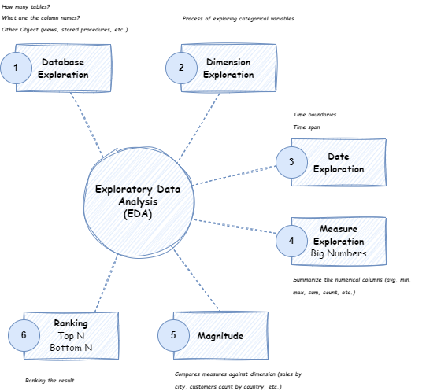

## What is Exploratory Data Analysis (EDA) in SQL?

EDA is the process of understanding and uncovering insights from a dataset using SQL. It involves asking the right questions, profiling data (e.g., checking unique values, aggregations), and analyzing dimensions (categories) and measures (numeric metrics). The goal is to explore data structure, detect patterns, and derive meaningful business insights.


## How to Initialize the Database

Run the following script `init_database.sql` in your SQL client, SQL Server preferrable. This script will create all the tables, Views, Schemas, Stored Procedures, etc. It will also populate the tables so, that you can directly start exploring without and hurdle.

## Key Steps in EDA visualized
The diagram shows the key steps to Explore your dataset to gain insight from it.



## How to categorize data in EDA?
Data is divided into two categories:

- **Dimensions:** Non-numeric columns (e.g., `city`, `product_name`) used for grouping.

- **Measures:** Numeric columns (e.g., `price`, `quantity`) that can be aggregated (summed, averaged).

**Rule:** If a column is numeric and aggregation makes sense (e.g., summing sales), it’s a measure; otherwise, it’s a dimension.

## How do you explore the structure of a database using SQL?

Query system tables like `INFORMATION_SCHEMA`:

```sql
-- List all tables:
SELECT * FROM INFORMATION_SCHEMA.TABLES;

-- List columns for a specific table (e.g., 'customers'):
SELECT * FROM INFORMATION_SCHEMA.COLUMNS 
WHERE TABLE_NAME = 'customers';
```

## What is Dimension Exploration in EDA?
**Dimension exploration** is the process of analyzing `categorical` (non-numeric) columns in a dataset to understand their unique values, distributions, and relationships. It helps answer questions like:

- What categories exist? (e.g., countries, product types)
- How many unique values are there?
- What is the hierarchy or granularity? (e.g., category → subcategory → product)

### How to Perform Dimension Exploration (with SQL Examples)

We can uses `DISTINCT` to extract unique values from dimension columns:

**Basic Syntax**

```sql
SELECT DISTINCT dimension_column 
FROM table_name;
```

**Practical Examples**

*Explore City (Low-Cardinality Dimension)*

```sql
-- Unique cities in customer data:
SELECT DISTINCT city 
FROM gold.dim_customers;
```

Output:
```
country
---------
phoenix
los angeles
san jose
san diego
new york
unknown
philadelphia
san antonio
houston
dallas
chicago
```
Insight: "Our customers come from 11 cities."

---
High-Cardinality Dimensions (e.g., Customer Names)

```sql
-- Count unique customers:
SELECT COUNT(DISTINCT customer_id) AS total_customers 
FROM gold.dim_customers;
```
Insight: "We have 149,635 unique customers."

---

### Why Dimension Exploration Matters

1. **Data Understanding:** Identifies valid categories (e.g., spotting typos like "USA" vs. "United States").

2. **Granularity:** Reveals hierarchies (e.g., region > country > city).

3. **Quality Checks:** Detects NULLs or unexpected values (e.g., "N/A" in country).

4. **Supports Aggregation:** Helps decide how to group measures (e.g., sales by category vs. subcategory).

**Key Takeaways**
- Dimensions are grouping axes for measures (e.g., "Show sales by country").
- Use DISTINCT to avoid duplicates in exploration.
- Combine dimensions to see relationships (e.g., category + subcategory).

## Date Exploration in EDA (Explained with SQL Examples)

Date exploration involves analyzing temporal data (e.g., order dates, birth dates) to understand trends, ranges, and patterns. The speaker emphasized uncovering:

- Time boundaries (earliest/latest dates).
- Time spans (e.g., total years of data).
- Derived metrics (e.g., customer age from birth dates).

### Key Techniques for Date Exploration
1. Find Date Boundaries
Use MIN() and MAX() to identify the start/end of your data:

```sql
-- First and last order dates:
SELECT 
    MIN(order_date) AS first_order,
    MAX(order_date) AS last_order
FROM gold.fact_orders;
```
Output:

first_order          | last_order
---------------------|--------------------
2023-01-01           | 2025-02-28


Insight: "Sales data spans from January 2023 to February 2025."

2. Calculate Time Spans
Use DATEDIFF() to measure intervals (years, months, days):

```sql
-- Total years/months of sales data:
SELECT 
    DATEDIFF(YEAR, MIN(order_date), MAX(order_date)) AS years_covered,
    DATEDIFF(MONTH, MIN(order_date), MAX(order_date)) AS months_covered
FROM gold.fact_orders;
```
Output:

years_covered | months_covered
--------------|---------------
2             | 25

Insight: "The dataset covers 2 years (25 months) of sales."


4. Extract Date Parts (Year, Month, Day)
Break down dates for trend analysis:

```sql
-- Sales count by year:
SELECT 
    YEAR(order_date) AS order_year,
    COUNT(*) AS total_orders
FROM gold.fact_orders
GROUP BY YEAR(order_date)
ORDER BY order_year;
```
Output:

Copy
order_year | total_orders
-----------|-------------
2023       | 731326
2024       | 732601
2025       | 117976

Insight: "2024 had the highest order volume."

### Why Date Exploration Matters
1. **Identify Trends:** Spot seasonality (e.g., holiday spikes).

2. **Data Quality:** Detect outliers (e.g., future-dated orders).

3. **Business Context:** Understand coverage (e.g., "Do we have 5 years of data or 5 months?").

---

### Advanced Date Analysis
- Use `DATEADD()` to shift dates (e.g., "6 months after purchase").
- Combine with `GROUP BY` for time-based aggregations (e.g., monthly revenue).
- Filter date ranges to focus on specific periods:

```sql
-- Sales in Q1 2014:
SELECT SUM(total) 
FROM gold.fact_orders
WHERE order_date BETWEEN '2023-01-01' AND '2023-03-31';
```

### Example: Full Date Profiling Query

```sql
-- Comprehensive date exploration for sales:
SELECT
    MIN(order_date) AS earliest_date,
    MAX(order_date) AS latest_date,
    DATEDIFF(DAY, MIN(order_date), MAX(order_date)) AS days_active,
    COUNT(DISTINCT CAST(order_date AS DATE)) AS unique_dates_with_orders
FROM gold.fact_orders;
```
Output:

Copy
earliest_date | latest_date | days_active | unique_dates_with_orders
--------------|-------------|-------------|------------------------
2023-01-01    | 2025-02-28  | 789        | 790

Insight: "Orders were placed on 790 unique days over 789 days (2.16 years)."

### Key Takeaways
- **Boundaries:** Use `MIN()`/`MAX()` to define your dataset’s time range.
- **Spans:** `DATEDIFF()` quantifies coverage (years, months, days).
- **Granularity:** Break dates into parts (year/month) for trend analysis.

---
## Measure Exploration in EDA (Step-by-Step Guide with SQL Examples)
Measure exploration focuses on analyzing numeric columns (metrics like sales, quantity, price) to uncover key statistics, distributions, and business KPIs. The speaker emphasized using aggregation functions (`SUM`, `AVG`, `COUNT`, etc.) to summarize these values.

**1. Core Techniques for Measure Exploration**

**A. Basic Aggregations**

Calculate totals, averages, and counts for key measures:

Example 1: Total Sales & Quantity

```sql
SELECT
    SUM(total) AS total_revenue,
    SUM(quantity) AS total_items_sold,
    AVG(price) AS avg_price_per_item,
    COUNT(DISTINCT order_number) AS unique_orders
FROM gold.fact_orders;
```
Output:

total_revenue | total_items_sold | avg_price_per_item | unique_orders
--------------|------------------|--------------------|--------------
1,121,619,079    | 4,745,375           | 236             | 1,581,903

Insight:

- The business generated **$1.12B** in revenue from **4.7M** items sold.
- Average item price: **$236**.
- **1.5M** unique orders exist (some orders contain multiple items).
---
Example 2: Customer Metrics

```sql
SELECT
    COUNT(DISTINCT customer_id) AS total_customers,
    COUNT(DISTINCT CASE WHEN gender = 'male' THEN customer_key END) AS male_customers,
    COUNT(DISTINCT CASE WHEN gender = 'female' THEN customer_key END) AS female_customers
FROM gold.dim_customers;
```
Output:

total_customers | male_customers | female_customers
----------------|----------------|-----------------
1,49,635          | 58,391          | 58,441

Insight:
- Nearly equal gender distribution among customers.

---

**B. Measure Distribution (Min, Max, Range)
Identify outliers and value ranges:**

```sql
SELECT
    MIN(total) AS min_sale,
    MAX(total) AS max_sale,
    MAX(total) - MIN(total) AS sale_range,
    AVG(total) AS avg_sale
FROM gold.fact_orders;
```
Output:

min_sale | max_sale | sale_range | avg_sale
---------|----------|------------|---------
99     | 2495    | 2396   | 709

Insight:

- Sales range from 99 to 2495.
- Average sale amount: $709.

---

**C. Measure Segmentation (Filtered Aggregations)**

Compare subsets of data:

```sql
-- Revenue by high/low-price items:
SELECT
    CASE 
        WHEN price > 200 THEN 'High-Price'
        ELSE 'Low-Price' 
    END AS price_segment,
    SUM(total) AS segment_revenue,
    COUNT(*) AS orders
FROM gold.fact_orders
GROUP BY CASE WHEN price > 200 THEN 'High-Price' ELSE 'Low-Price' END
```
Output:

price_segment | segment_revenue | orders
--------------|-----------------|-------
High-Price    | 776,513,796      | 850,647
Low-Price     | 345,105,283       | 731,256

Insight:
- High-price items drive 69% of revenue (7.7M of 1.1B).
---

**2. Combining Measures with Dimensions**

**A. Sales by Product Category**

```sql
SELECT 
	c.category_name,
	SUM(o.total) total_sales,
	SUM(o.quantity) items_sold
FROM gold.fact_orders o
INNER JOIN gold.dim_products p
	ON o.product_id = p.product_id
INNER JOIN gold.dim_categories c
	ON p.category_id = c.category_id
GROUP BY c.category_name
ORDER BY total_sales DESC;
```
Output:

category    | category_revenue | items_sold
------------|------------------|-----------
coat       | 308,723,380       | 727,870
top wear | 261,292,201          | 109,301,9
head wear    | 199,870,506          | 146,478,4
---|---|---|

Insight:

- **Coat** dominate revenue (27.5% of total). Followed by **Top-wear** (23.2%) and **Head-wear** (17.8%).

**B. Revenue per City**

```sql
SELECT
    c.city,
    SUM(o.total) AS city_revenue,
    COUNT(DISTINCT o.customer_id) AS customers
FROM gold.fact_orders o
INNER JOIN gold.dim_customers c ON o.customer_id = c.customer_id
GROUP BY c.city
ORDER BY city_revenue DESC;
```

Output:

city     | city_revenue | customers
------------|-----------------|----------
unknown         | 152,982,596      | 2,541
phoenix     | 100,117,155       | 1,656
new york      | 997,680,86       | 1,662

Insight:

- Phoenix generates 8.9% of revenue. Followed by New York 8.8%. 13% of revenue is generated by those customers who have not added their city.

**3. Advanced: Window Functions for Measures**

**A. Running Totals (Cumulative Revenue)**

```sql
SELECT
    order_date,
    total,
    SUM(total) OVER (ORDER BY order_date) AS running_total
FROM gold.fact_orders
ORDER BY order_date;
```

Output:

order_date  | sales_amount | running_total
------------|--------------|--------------
2010-12-01  | 1,200        | 1,200
2010-12-02  | 800          | 2,000
...
2014-01-06  | 3,000        | 29,358,677


Insight:

Track revenue growth over time.

**B. Percent of Total (Contribution Analysis)**

In SQL, when you divide two integers, the result is also an integer, and any fractional part is truncated. In this case, 308723380 divided by 1121619079 is less than 1, so the integer part is 0. Thats why we need to convert at least on of the number to float.

```sql
SELECT
    p.category_id,
    SUM(o.total) AS revenue,
	ROUND(CAST(SUM(o.total) AS FLOAT)/(SELECT SUM(total) FROM gold.fact_orders), 3) * 100 AS total_revenue
FROM gold.fact_orders o
JOIN gold.dim_products p ON o.product_id = p.product_id
GROUP BY p.category_id
ORDER BY revenue DESC;
```
Output:

category    | revenue    | pct_of_total
------------|------------|-------------
cat1       | 308723380 | 27.5%
cat2 | 261292201    | 23.3%
cat5    | 199870506    | 17.8%
...|...|...

Insight:

- cat1 (Coat) contribute 27.5% of total revenue. Followed by cat2 (Top-wear) and cat5 (Head-wear) 23.3% and 17.% respectively.

**Key Takeaways**
- **Aggregations:** Use `SUM`, `AVG`, `MIN`, `MAX`, `COUNT` to summarize measures.
- **Segmentation:** Combine with `GROUP BY` to compare subsets (e.g., by category/country).
- **Advanced Analytics:** Window functions (OVER) enable running totals, rankings, and % contributions.
- **Business Insights:** Focus on high-impact measures (e.g., revenue, unit sales).

## What is "magnitude analysis," and how is it performed?
Magnitude analysis compares measures across dimensions (e.g., `total` by `city`). The code:

```sql
SELECT 
    dimension_column (e.g., city), 
    SUM(measure_column) AS total_measure (e.g., total)
FROM table
GROUP BY dimension_column
ORDER BY total_measure DESC;
```

Example:
```sql
-- Total revenue by product category:
SELECT 
    p.category_id, 
    SUM(o.total) AS total_revenue
FROM orders o
LEFT JOIN products p ON o.product_id = p.product_id
GROUP BY p.category_id
ORDER BY total_revenue DESC;
```

## How do you perform ranking analysis in SQL?

Use TOP or *window functions* (`ROW_NUMBER`, `RANK`):

```sql
-- Top 5 products by revenue (using TOP):
SELECT TOP 5
    p.product_name,
    SUM(s.sales_amount) AS total_revenue
FROM sales s
JOIN products p ON s.product_key = p.product_key
GROUP BY p.product_name
ORDER BY total_revenue DESC;

-- Using ROW_NUMBER():
WITH RankedProducts AS (
    SELECT
        p.product_name,
        SUM(s.sales_amount) AS total_revenue,
        ROW_NUMBER() OVER (ORDER BY SUM(s.sales_amount) DESC) AS rank
    FROM sales s
    JOIN products p ON s.product_key = p.product_key
    GROUP BY p.product_name
)
SELECT * FROM RankedProducts WHERE rank <= 5;
```

## Why is it important to use DISTINCT with COUNT for order analysis?

Orders may repeat in fact tables (e.g., one order with multiple items). Using DISTINCT ensures accurate counts:

```sql
-- Correct count of unique orders:
SELECT COUNT(DISTINCT order_number) AS total_orders FROM sales;
```

### How do you explore date boundaries in a dataset?

Use `MIN()` and `MAX()` to find date ranges:

```sql
-- Date range of orders:
SELECT 
    MIN(order_date) AS first_order,
    MAX(order_date) AS last_order,
    DATEDIFF(YEAR, MIN(order_date), MAX(order_date)) AS year_span
FROM sales;
```

## What key metrics are recommended to summarize in EDA?

Combine measures into a single report:

```sql
SELECT 'total_sales' AS measure_name, SUM(sales_amount) AS measure_value FROM sales
UNION ALL
SELECT 'avg_price', AVG(price) FROM sales
UNION ALL
SELECT 'total_customers', COUNT(DISTINCT customer_key) FROM customers;
```

## What’s the difference between low- and high-cardinality dimensions?

- **Low-cardinality:** Few unique values (e.g., gender, country). Queries return fewer rows.

- **High-cardinality:** Many unique values (e.g., customer_id). Queries return more rows.

**Impact:** High-cardinality dimensions (like customer-level analysis) generate detailed but voluminous results.

## Congratulations!!!
You have successfully explores your dataset.
